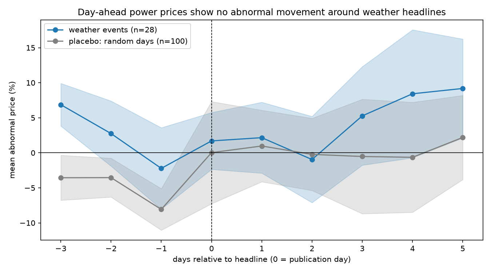

# energy-signal-llm

An end to end LLM pipeline that pulls a year of headlines from the Guardian API,
labels each with event type and region using Claude Haiku, and validates the labels
against 140 hand-labelled headlines. I then test if the labelled weather events have
an effect on day-ahead electricity prices in five European markets.

I built this to learn how to build and properly evaluate an LLM pipeline on real
data, after noticing most job postings I was applying to asked for exactly that.

## Results

The LLM's labels for event_type and region were compared against my hand-made labels.
I sampled 100 headlines at random to see how the model performs on the real news
stream, and another 40 using a weather focused query, since the random stream is 98%
non-events and I needed enough real weather events to measure per-class accuracy.
The event types are heatwave, cold, storm, flood, drought or none. The regions are
UK, Germany, France, Spain, Netherlands, Europe or other.

- On the weather event-rich set the model classified 90% of event types correctly
  (macro F1 0.89). Always guessing the most common label scores 37.5% on this set.
  One round of prompt fixes based on error analysis lifted this from 82.5%
  (macro F1 0.68).
- For region the model scored 96% on the random set and 97.5% on the event-rich
  set, against a 52% most-common-label baseline. Example output.
  "Storm Bram batters Britain and Ireland with strong winds and heavy rain" ->
  {event_type: storm, region: UK}
- The event study covered 28 distinct weather events across the 5 markets. Prices
  on headline days averaged just 1.7% above each event's own prior-week normal
  (standard error 4%). I also ran the same computation on 100 random no-event days
  as a control, and it produced swings up to 8%, bigger than anything in the real
  event curve. So no price reaction to weather headlines is detectable at this
  sample size.

### Full extraction metrics

Event type, weather event-rich set (n=40), after prompt iteration.

| class | precision | recall | F1 | support |
|---|---|---|---|---|
| cold | 1.00 | 0.50 | 0.67 | 4 |
| drought | 1.00 | 1.00 | 1.00 | 1 |
| flood | 0.67 | 1.00 | 0.80 | 4 |
| heatwave | 1.00 | 1.00 | 1.00 | 5 |
| none | 1.00 | 0.87 | 0.93 | 15 |
| storm | 0.85 | 1.00 | 0.92 | 11 |
| accuracy |  |  | 0.90 | 40 |
| macro avg | 0.92 | 0.89 | 0.89 | 40 |

Region, random set (n=100).

| class | precision | recall | F1 | support |
|---|---|---|---|---|
| Europe | 1.00 | 0.80 | 0.89 | 5 |
| UK | 0.98 | 0.93 | 0.95 | 43 |
| other | 0.95 | 1.00 | 0.97 | 52 |
| accuracy |  |  | 0.96 | 100 |

On the random set, event accuracy is 97% against a 98% majority baseline. A model
that blindly answers "none" beats it on raw accuracy while finding zero events,
which is exactly why the per-class table above is the metric that matters on a
98% non-event stream.

### Event study, real events vs placebo

Each day's mean abnormal price, expressed in units of its own standard error.
A mean under about 2 SE is inside its own noise.

| day vs headline | events mean % | events mean/SE | placebo mean % | placebo mean/SE |
|---|---|---|---|---|
| -3 | +6.9 | 2.3 | -3.6 | 1.1 |
| -2 | +2.7 | 0.6 | -3.5 | 1.3 |
| -1 | -2.2 | 0.4 | -8.1 | 2.7 |
| 0 | +1.7 | 0.4 | 0.0 | 0.0 |
| +1 | +2.2 | 0.4 | +1.0 | 0.2 |
| +2 | -1.0 | 0.2 | -0.2 | 0.0 |
| +3 | +5.3 | 0.8 | -0.5 | 0.1 |
| +4 | +8.4 | 0.9 | -0.6 | 0.1 |
| +5 | +9.2 | 1.3 | +2.2 | 0.4 |

The largest excursion in the real curve (2.3 SE at day -3) is smaller than the
largest excursion the placebo produced from pure noise (2.7 SE). Nothing the real
events did exceeds what random days did on their own.

The null result makes sense when you think about it. Day-ahead power markets price
weather using meteorological forecasts, which exist days before journalists write
about the weather. By the time a headline is published the market has already moved.
Newspaper coverage is a lagging indicator of information traders already had.

### Example of error-driven prompt iteration

The first validation run showed the model labelling flood-risk stories as floods.
"One in nine new homes in England built in areas of flood risk, study shows" came
back as flood, even though no flood is happening in that story. I fixed it by adding
a rule to the prompt built from the failing cases, with contrasting examples.

> When the headline discusses weather risk, planning, or defences with no event
> occurring or forecast, label none.
> "One in nine new homes in England built in areas of flood risk" -> none
> "Floods could hit England while country is still in drought, forecasters say" -> drought

Two more patterns were fixed the same way. A tie-break rule for headlines reporting
two weather events at once, and an under-applied UK default for domestic stories
that name no country. Together these took event accuracy from 82.5% to 90%.

## How it works

1. `src/ingest.py` pulls 12 months of energy related headlines from the Guardian
   API (279 articles). Fetched in weekly windows so an interrupted run can resume
   where it stopped
2. `src/ingest_weather.py` is a second pull with a weather focused query (752
   headlines), because real weather events turned out to be rare in the energy
   news stream
3. I hand-labelled 140 headlines following the rules in `LABELLING_GUIDE.md`,
   split into the two evaluation sets described above
4. `src/extract.py` labels every headline with event_type and region using Claude
   Haiku. A Pydantic schema with fixed allowed values rejects invalid model output
   at the parse step, and results are cached to disk by URL so reruns only pay for
   new headlines
5. `src/validate.py` scores the LLM labels against my hand labels, reporting
   accuracy against the majority baseline, confusion matrices and per-class
   precision, recall and F1
6. `src/features.py` builds daily electricity prices for the 5 markets from two
   sources. Elexon BMRS Market Index for the UK (volume weighted daily average),
   and the Energy-Charts API for Germany, France, Spain and the Netherlands
   (daily mean of day-ahead prices)
7. `notebooks/event_study.ipynb` builds the final event list (LLM labels, hand
   label overrides where they exist, then a manual review that cut 63 candidates
   down to 29 real events) and runs the event study with the placebo control

## Design decisions

- Labels are assigned from the headline only, because the headline is all the model
  sees. Labelling with information the model cannot access would make the
  evaluation unfair
- Region labels match electricity bidding zones, one price per zone, so events can
  be joined to prices. Britain, England, Scotland and GB all normalise to UK
- Events labelled only "Europe" were excluded from the study instead of being
  assigned to all five markets, since the headline does not say which markets were
  actually affected
- UK prices use a volume weighted average, which automatically handles a data
  provider that reports zero-volume placeholder rows
- I reviewed the 63 event candidates by hand before the study, which removed 34
  false positives. Ten minutes of review at the narrow end of the funnel was the
  cheapest accuracy gain in the whole project

## Limitations

- 29 events in one year is a small sample. The study mostly demonstrates the method
- The headline date is a proxy for the event date, and aftermath coverage lags the
  actual weather
- The 2 day clustering window suits storms but splits long events like droughts
  and heatwaves, which I merged in the manual review
- UK prices are a traded spot index while the EU series are day-ahead auction
  prices. Related instruments, but not identical
- Events the extractor missed (measured none-recall around 90%) are absent from
  the study. This loss is quantified but not corrected
- Days -3 to -1 fall inside both the baseline week and the event window, a known
  quirk of simple event study designs

## Data sources

- Headlines from the Guardian Open Platform API
- UK prices from the Elexon BMRS Market Index (MID)
- EU prices from the Energy-Charts API by Fraunhofer ISE, licensed CC BY 4.0
- Labelling rules and prompt content in `LABELLING_GUIDE.md`

## Running it

    pip install -r requirements.txt

Create a `.env` in the repo root with `GUARDIAN_API_KEY` and `ANTHROPIC_API_KEY`,
then run in order.

    python src/ingest.py
    python src/ingest_weather.py
    python src/extract.py
    python src/validate.py
    python src/features.py

The event study runs in `notebooks/event_study.ipynb`.
